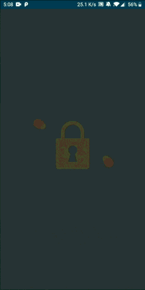
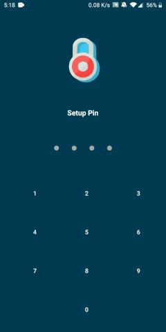
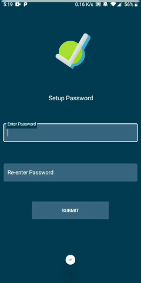

# ShakeLock

*CSCI-5708 Mobile Computing Group Project*

The android application developed using Kotlin secures user personal/private data on a single click or gesture triggers such as shakelistener, voice input or widget. The application allows users to predefienly input their personal data that needs to be secured in case on emergency event or trigger. The project was developed using Agile Methodology and completely adheres to GitFlow to avoid merge conflicts among team members working on the same feature and to maintain clean and tidy code. 

## Splash, Introduction and Dashboard 

The application comprises of animated splash screen followed with introductory session on implemented features using graphics and text description. The dashboard Activity allows user to select the locking mechanism that they need to bypass while performing encryption/decryption process on their data.

  

## Locking Mechanisms

The application supports several locking mechnisms such as pin, password, biometrics and pattern and the implementation performs several operations based on their input.

  

## Encryption/Decryption

The Encryption/Decryption will be performed using AES algorithm based on the 128-bit MD5 key generated using the linked email and the existing encrypted file will be removed to avoid further tampering to the data.

## Contact Us

